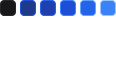

#  Trilha Ignite | Rocketseat

### Projeto criado durante o evento <strong>NLW COPA</strong> onde foi desenvolvido uma plataforma web e mobile com backend onde podemos criar bolões e fazer as nossos palpites.

<hr>

&nbsp;

| :placard: Vitrine.Dev |                                                                                                                                                        |
| --------------------- | ------------------------------------------------------------------------------------------------------------------------------------------------------ |
| :sparkles: Nome       | **NLW Copa Trilha Ignite**                                                                                                                             |
| :label: Tecnologias   | nodejs, javascript, babel, typescript, react-native, html5, postcss, css3, reactjs, nextjs, prettier, axios, sqlite3, figma, expo, prisma, tailwindcss |
| :rocket: URL          | -                                                                                                                                                      |
| :fire: Desafio        | -                                                                                                                                                      |

&nbsp;

<hr>


<hr>

&nbsp;

<p align="center">
  <a href="#-tecnologias-utilizadas">Tecnologias</a> -
  <a href="#-resultado-aplicação-web">Resultado WEB</a> -
  <a href="#-resultado-aplicação-mobile">Resultado MOBILE</a> -
  <a href="#-como-executar">Como executar</a> - 
  <a href="#-contato">Contato</a>
</p>

&nbsp;

<a id="-tecnologias-utilizadas"></a>

## Tecnologias utilizadas

<p align="center">
  <a href= "https://html5.org/"></a>
  <a href= "https://developer.mozilla.org/pt-BR/docs/Web/CSS"></a>
  <a href= "https://tailwindcss.com/"></a>
  <a href= "https://postcss.org/"></a>
  <a href= "https://www.javascript.com/"></a>
  <a href= "https://www.typescriptlang.org/"></a>
  <a href= "https://babeljs.io/"></a>
  <a href= "https://nodejs.org/en/"></a>
  <a href= "https://reactjs.org/"></a>
  <a href= "https://reactnative.dev/"></a>
  <a href= "https://expo.dev/"></a>
  <a href= "https://nextjs.org/"></a>
  <a href= "https://www.fastify.io/"></a>
  <a href= "https://axios-http.com/"></a>
  <a href= "https://www.prisma.io/"></a>
  <a href= "https://www.sqlite.org/index.html"></a>
  <a href= "https://www.figma.com/file/IBaKjqTi23ai3kkJ5XdMcN/Bol%C3%A3o-da-Copa-(Community)-(Copy)"></a>
  <a href= "https://code.visualstudio.com/download"></a>
  <a href= "https://github.com/prettier/prettier"></a>
</p>

<p align="center">
  <a href="#license"></a>
  <a href="https://github.com/LivioAlvarenga/Nlw-Copa-Rocketseat/issues"></a>
  <a href="https://github.com/LivioAlvarenga/Nlw-Copa-Rocketseat"></a>
  <a href="https://github.com/LivioAlvarenga/Nlw-Copa-Rocketseat"></a>
  <a href="https://github.com/LivioAlvarenga/Nlw-Copa-Rocketseat"></a>
<p>
<p align="center">
  <a href= "https://www.livioalvarenga.com/"></a>
  <a href= "https://www.linkedin.com/in/livio-alvarenga-planejamento-mrp-engenheiro-produ%C3%A7%C3%A3o-materiais-vba-powerbi/"></a>
  <a href= "https://twitter.com/AlvarengaLivio"></a>
  <a href= "https://www.instagram.com/livio_alvarenga/"></a>
  <a href= "https://www.youtube.com/channel/UCrZgsh8IWyyNrRZ7cjrPbcg"></a>
  
</p>

&nbsp;

<a id="-resultado-aplicação-web"></a>

## :computer: Resultado Aplicação WEB


&nbsp;

<a id="-resultado-aplicação-mobile"></a>

## :iphone: Resultado Aplicação Mobile


&nbsp;

<a id="-como-executar"></a>

## :white_check_mark: Como executar

Para executar as aplicações seguir os procedimentos abaixo:

-   SERVER;
-   WEB;
-   MOBILE.

-- Procedimento Iniciar backend --

-   Acessar primeiro o diretório server com o comando

```bash
cd server
```

-   Instalar as dependências do backend

```bash
npm install
```

-   Iniciar o backend com o comando

```bash
npm run dev
```

Com o backend rodando você pode escolher entre a aplicação WEB ou MOBILE

-- Procedimento iniciar aplicação WEB --

-   Acessar primeiro o diretório web com o comando

```bash
cd web
```

-   Instalar as dependências da aplicação WEB

```bash
npm install
```

-   Iniciar a aplicação web com o comando

```bash
npm run dev
```

-- Procedimento iniciar aplicação MOBILE --

-   Acessar primeiro o diretório mobile com o comando

```bash
cd mobile
```

-   Alterar os endereços de IP na pasta SCREENS nos componetes GAME e HOME. Insearir o IP da sua máquina Arquivos index.ts desses 2 componentes.

-   Instalar as dependências da aplicação MOBILE

```bash
npm install
```

-   Iniciar a aplicação web com o comando

```bash
expo start
```

A aplicação "server" se integra com a "web" e a "mobile", realizando o Back-end. Caso queira rodar as aplicações basta utilizar os seguintes comandos:

Rodando a aplicação web, primeiro iniciar o servidor e depois o próprio "web", ambos com o comando:

```bash
npm run dev
```

&nbsp;

<a id="-contato"></a>

## :email: Contato

Olá, eu sou Livio Alvarenga, Engenheiro de Produção | Dev Back-end e Front-end. Sou aficcionado por tecnologia, programação, processos e planejamento. Uni todas essas paixões em uma só profissão. Dúvidas, sugestões e críticas são super bem vindas. Seguem meus contatos.

-   [www.livioalvarenga.com](https://livioalvarenga.com)
-   contato@livioalvarenga.com

&nbsp;

## :no_entry_sign: License

Este projeto é [MIT licensed](./LICENSE).

&nbsp;

## :books: Mais informações

Rocketseat: [Acelere cada etapa da sua carreira em programação](https://www.rocketseat.com.br/).

&nbsp;

## :smile: Agradecimento especial

Agradeço ao [Rodrigo Santana](https://www.linkedin.com/in/rodrigo-goncalves-santana/), [Diego Fernandes](https://www.linkedin.com/in/diego-schell-fernandes/) e [Mayk Brito](https://www.linkedin.com/in/maykbrito/). Muito Obrigado! Vocês realmente fazem a diferença. Valeu [Rocketseat](https://www.alura.com.br/)!!!

##### _#CompartilheConhecimento_
